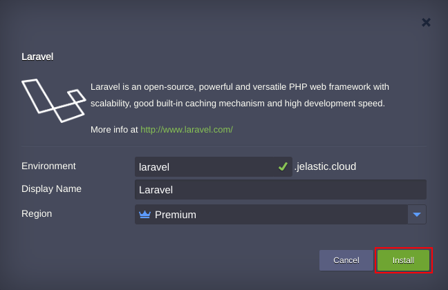
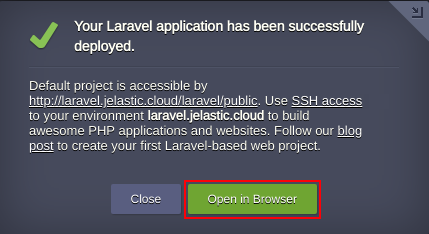

# Laravel PHP Framework

Laravel is a powerful and versatile development tool with scalability, good built-in caching mechanism and high development speed.

## Package Implementation Specifics

The package is presented as a single node environment with PHP framework only. If required it can be complemented with nodes of any available [layers](https://docs.jelastic.com/jelastic-basic-hosting-concepts#layer).

## How to Install Laravel

In order to get Laravel Framework instantly deployed, click the **Deploy to Jelastic** button below and specify your email address within the opened widget. Then choose one of the [Jelastic Public Cloud](https://jelastic.cloud) providers (in case you don’t have an account at the appropriate platform, it will be created automatically) and press **Install**.

To install the package manually, log in to the Jelastic dashboard with your credentials and [import](https://docs.jelastic.com/environment-import) link to the [**_manifest.jps_**](https://raw.githubusercontent.com/jelastic-jps/laravel/master/manifest.jps) file.

Within the opened installation window, type *Environment* name and optional *Display Name* ([environment alias](https://docs.jelastic.com/environment-aliases)). Also, select the preferable [Region](https://docs.jelastic.com/environment-regions) (if several ones are available) and click **Install**.

Wait a few minutes for Jelastic to prepare your environment and set up framework. When finished, you’ll be shown the appropriate notification. Press **Open in Browser** button to make sure that application is up and running. 

This information will be also duplicated to you via email.

To find more details on Laravel package installation and use, refer to the [article](https://www.virtuozzo.com/company/blog/laravel-framework-automatic-installation-develop-php-applications/).
